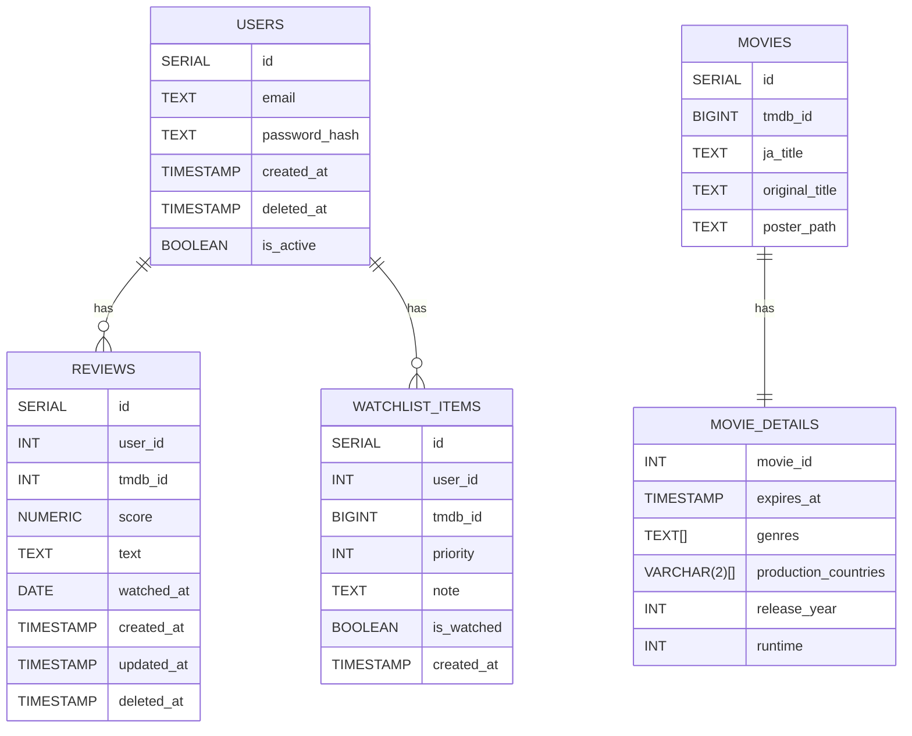

<!-- omit in toc -->
# データ設計

<!-- omit in toc -->
### テーブル一覧

- [users](#users)
- [movies](#movies)
- [movie\_details](#movie_details)
- [reviews](#reviews)
- [watchlist\_items](#watchlist_items)

## users

ユーザー情報

| カラム名       | 型           | 説明               |
| -------------- | ------------ | ------------------ |
| id             | SERIAL       | ユーザーID         |
| email          | TEXT         | メールアドレス     |
| password_hash  | TEXT         | パスワードのハッシュ値 |
| created_at     | TIMESTAMP    | アカウント作成日時 |
| deleted_at     | TIMESTAMP    | アカウント削除日時 |
| is_active      | BOOLEAN      | アカウントの有効性 |

- email
    - UNIQUE
- deleted_at
    - NULLでない場合は論理削除扱い
- is_active
    - DEFAULT FALSE
    - TRUEの場合のみログイン可能

## movies

外部APIキャッシュ（永続化）

| カラム名       | 型     | 説明           |
| -------------- | ------ | -------------- |
| id             | SERIAL | 映画ID         |
| tmdb_id        | BIGINT | TMDB内のID     |
| ja_title       | TEXT   | 日本語タイトル |
| original_title | TEXT   | 原題           |
| poster_path    | TEXT   | ポスターURL    |

- poster_path
    - https://image.tmdb.org/t/p/w500/ ＋ poster_path

## movie_details

外部APIキャッシュ（TTL）

| カラム名             | 型           | 説明           |
| -------------------- | ------------ | -------------- |
| movie_id             | INT          | 映画ID         |
| expires_at           | TIMESTAMP    | 最終利用日時   |
| genres               | TEXT[]       | ジャンル       |
| production_countries | VARCHAR(2)[] | 製作国（ISO国名コード）         |
| release_year         | INT          | 公開年         |
| runtime              | INT          | 上映時間       |

- movie_id
  - PRIMARY KEY
  - FOREIGN: movies.id(ON DELETE CASCADE)
- expires_at
    - キャッシュが最後に使われた日時 + 7日

## reviews

| カラム名   | 型           | 説明                 |
| ---------- | ------------ | -------------------- |
| id         | SERIAL       | レビューID           |
| user_id    | INT          | ユーザーID           |
| tmdb_id    | BIGINT       | TMDB内の映画ID       |
| score      | NUMERIC(2,1) | 点数                 |
| text       | TEXT         | レビュー本文         |
| watched_at | DATE         | 視聴日               |
| created_at | TIMESTAMP    | レビュー作成日時     |
| updated_at | TIMESTAMP    | レビュー最終更新日時 |
| deleted_at | TIMESTAMP    | レビュー削除日時     |

- user_id
    - FOREIGN: users.id(ON DELETE CASCADE)
- score
    - 星5評価（0.0〜5.0）
- deleted_at
    - NULLでない場合は論理削除扱い

## watchlist_items

| カラム名   | 型        | 説明                   |
| ---------- | --------- | ---------------------- |
| id         | SERIAL    | ウォッチリストID       |
| user_id    | INT       | ユーザーID             |
| tmdb_id    | BIGINT    | TMDB内の映画ID         |
| priority   | INT       | 優先度（%）            |
| note       | TEXT      | メモ                   |
| is_watched | BOOLEAN   | 視聴済みフラグ         |
| created_at | TIMESTAMP | ウォッチリスト追加日時 |

- user_id
    - FOREIGN: users.id(ON DELETE CASCADE)
- priority
    - 0〜100の整数[%]
- is_watched
    - DEFAULT FALSE
    - TRUEならば視聴済み